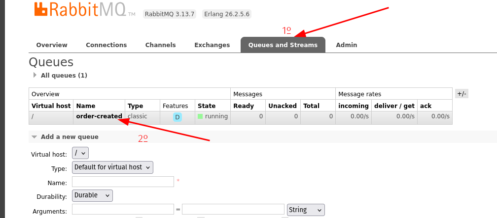
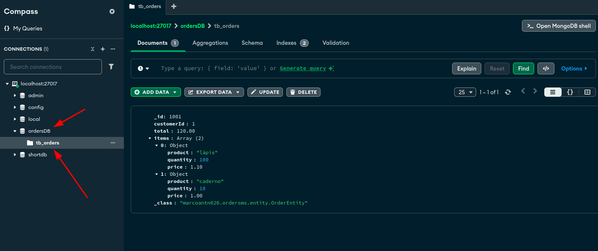

## Escopo
Processar pedidos e gerar relatório.

## Atividades
1. Elabore e entregue um plano de trabalho.
   - Crie suas atividades em tasks
   - Estime horas
2. Crie uma aplicação, na tecnologia de sua preferência (JAVA, DOTNET, NODEJS)
3. Modele e implemente uma base de dados (PostgreSQL, MySQL, MongoDB).
4. Crie um micro serviço que consuma dados de uma fila RabbitMQ e grave os dados para conseguir listar as informações:
   - Valor total do pedido
   - Quantidade de Pedidos por Cliente
   - Lista de pedidos realizados por cliente

Exemplo da mensagem que deve ser consumida:

```
   {
       "codigoPedido": 1001,
       "codigoCliente":1,
       "itens": [
           {
               "produto": "lápis",
               "quantidade": 100,
               "preco": 1.10
           },
           {
               "produto": "caderno",
               "quantidade": 10,
               "preco": 1.00
           }
       ]
   }
```


5. Crie uma API REST, em que permita o consultar as seguintes informações:
   - Valor total do pedido
   - Quantidade de Pedidos por Cliente
   - Lista de pedidos realizados por cliente

## Rodar projeto
### Requisitos
- docker e docker-compose
- java versão 17

abra o terminal dentro do projeto
```
cd docker
docker-compose up -d
```
execute o projeto usando a idea, ou pelos comandos
```
gradle build
gradle run
```
acesse o swagger

[Swagger - Orders-ms](http://localhost:8080/swagger-ui/index.html#)

antes fazer uma requisição deve publicar uma messagem na fila para isso siga os comandos:

acesse o rabbit pelo navegador

[RabbitMQ](http://localhost:15672/)
```
username: guest
password: guest
```
- 1º selecione a aba de Queues and Streams
- 2º selecione a queue order-created (conforme imagem abaixo)



- 3º selecione Publish Message
- 4º copie e cole o json abaixo (veja o exemplo na imagem abaixo)
```
   {
       "codigoPedido": 1001,
       "codigoCliente":1,
       "itens": [
           {
               "produto": "lápis",
               "quantidade": 100,
               "preco": 1.10
           },
           {
               "produto": "caderno",
               "quantidade": 10,
               "preco": 1.00
           }
       ]
   }
```
- 5º publique na fila


Agora basta realizar a request pelo swagger passando o o customerId como 1


#### Caso queira ver os dados no Mongo é necessario ter o MongoDB Compass instalado

